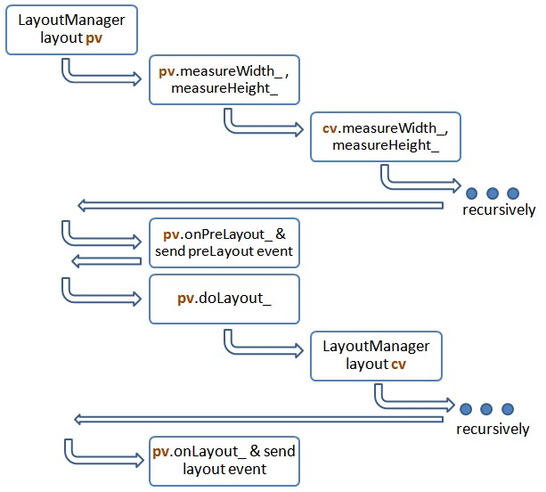

#Layout Lifecycle and Customization

##Lifecyle
Let us assume we have a view called `pv` and it has a child view called `cv`. Here is a flow how Rikulo handles the layout `pv` (triggered by, say, [View.requestLayout](api:view)).

* The handling of layout is taken from the parent to its child views. In other words, in this case, `pv` will be handled and then `cv`.
* When handling the layout, [View.measureWidth_](api:view) and [View.measureHeight_](api:view) will, if necessary, be called recursively from the parent to its child views to measure the dimension.
* [View.onPreLayout_](api:view) will be called after the view has been handled, but before its child views. On the other hand, [View.onLayout_](api:view) will be called after the view and all of its child views are handled.
* Instead of overriding them, the application is suggested to listen the `preLayout` and `layout`event instead, if necessary. They are sent by the default implementation of [View.onPreLayout_](api:view) and [View.onLayout_](api:view) respectively.
* [View.doLayout_](api:view) is called to handle the layout of *child* views. The default implementation delegates the invocation to [LayoutManager](api:layout), which will then delegate to the right implementation of [Layout](api:layout).
    * Notice, though a bit subtle, [View.doLayout_](api:view) is *not* called to layout the given view, which is handled by the parent's invocation of `doLayout`.

#Customization

You can provide additional layouts or replace the existent ones. To do so, you first implement the [Layout](api:layout) interface. Then, register it to [LayoutManager](api:layout). For example, assume you implement a tile layout, called `TitleLayout`, and  you can register it as follows.

    layoutManager.addLayout("tile", new TileLayout());

Then, you can use it in your application:

    view.layout.type = "tile";
